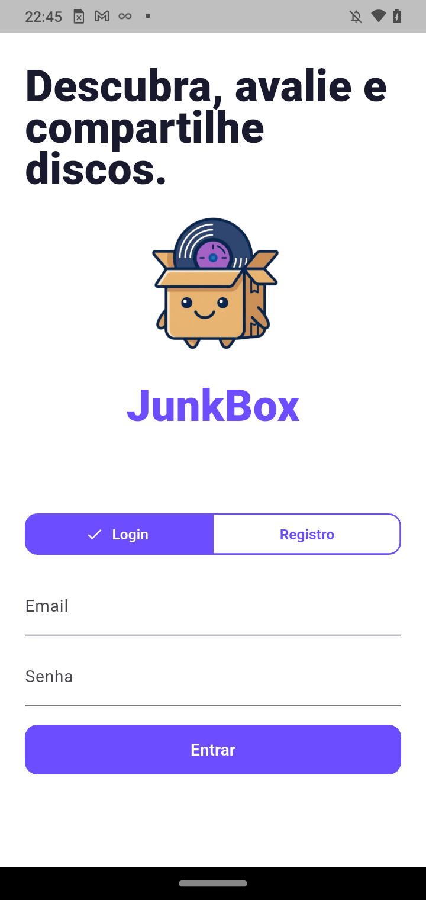
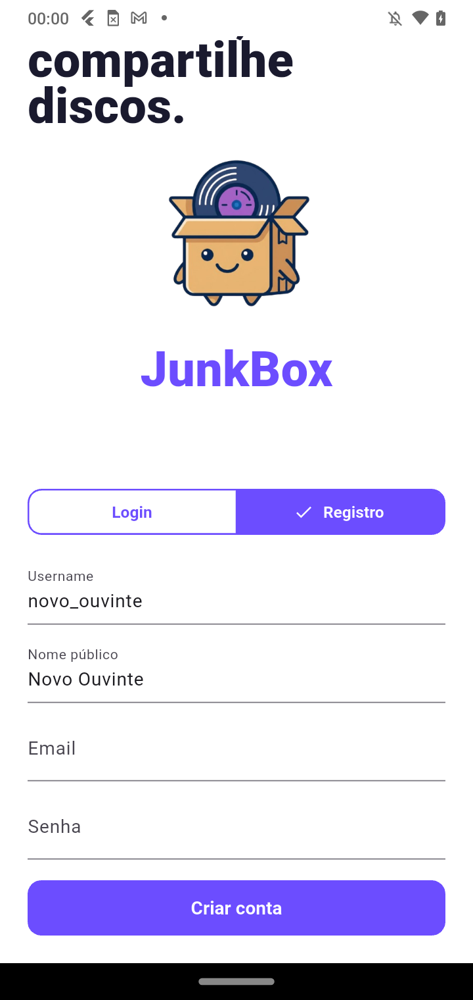
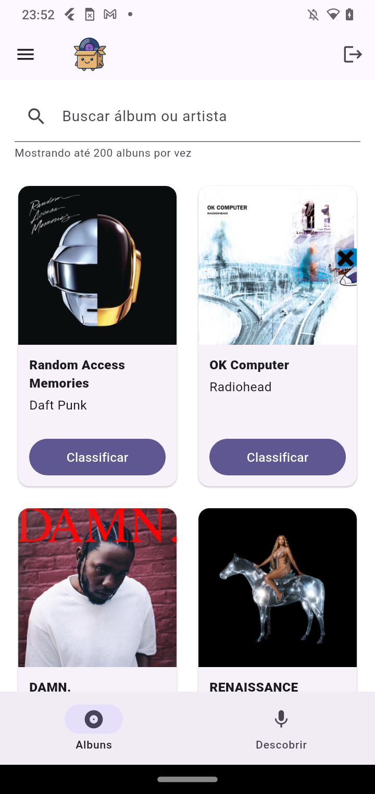
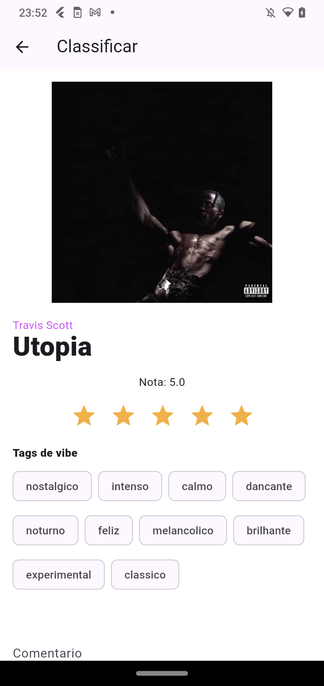
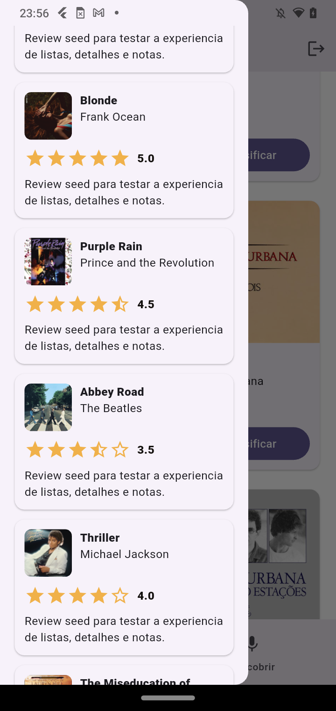
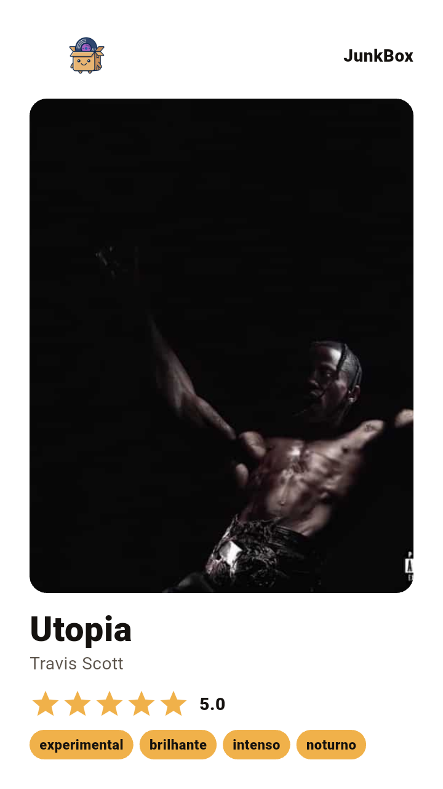
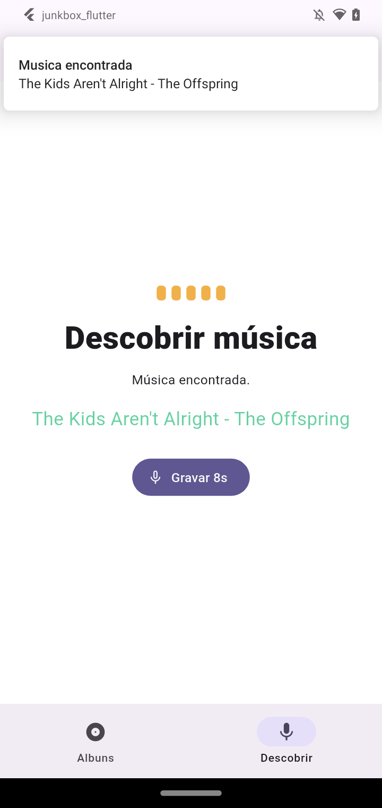
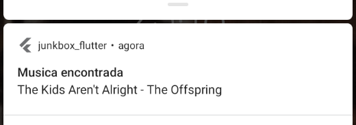

# JunkBox 

Quem não gosta de ouvir música? É um dos poucos gostos em comum entre a maior parte da humanidade. Independente do seu gênero favorito, certamente tem uma música ou até mesmo um álbum que marcou a sua história. E embora seja muito gostoso ouvir nossas músicas favoritas, não há nada melhor do que exibir o nosso bom gosto para as demais pessoas. 

A comunidade de filmes e séries já experimenta a sensação de poder compartilhar o seu "bom gosto" com os demais desde 2011, quando dois designers da Nova Zelândia inventaram o Letterboxd, uma rede social voltada para cinéfilos exporem suas avaliações sobre obras. O app veio bombar mesmo no início de 2020/2021, aparecendo nos stories da maioria dos jovens na época. 

O problema é que a comunidade da música nunca teve uma solução semelhante ao LetterBoxd, mesmo que pareça uma ideia muito boa. Existem apps que vão nessa direção, como o MusicBoard, que por mais que se assemelhe ao resultado esperado pela comunidade, tem uma experiência muito distante da fluídez que o Letterbox propõe. 

Quando li o enunciado dessa ponderada, logo pensei em resolver esse problema "a minha maneira", consolidando tudo que eu sempre sonhei para um app com essa proposta. É aí que nasce o JunkBox, o seu catálogo musical prontinho para avaliação.

## O que o JunkBox faz?

O JunkBox foi pensado para ser aquele lugar em que o seu gosto musical finalmente ganha forma. A proposta não é só guardar nomes de álbuns ou músicas, mas transformar a experiência de ouvir, descobrir, avaliar e compartilhar música em algo mais divertido, mais visual e mais próximo da forma como a gente já conversa sobre cultura na internet.

Você pode criar uma conta, entrar no seu próprio perfil e navegar por uma biblioteca cheia de álbuns e músicas. A biblioteca já vem alimentada com artistas nacionais e internacionais, capas reais e dados suficientes para que a experiência não pareça vazia logo no primeiro uso.

O grande centro da experiência está nas avaliações. Cada pessoa pode escolher um álbum, dar uma nota por estrelas, escrever um comentário e marcar tags de vibe que ajudam a traduzir melhor o sentimento daquela escuta. Às vezes um disco não é só bom ou ruim. Ele pode ser nostálgico, intenso, calmo, dançante, noturno, melancólico ou simplesmente ter aquela energia difícil de explicar.

Depois de avaliar, o usuário também pode salvar tudo no seu histórico e abrir uma barra lateral para rever suas próprias avaliações. Essa parte deixa o JunkBox com uma cara de diário musical, como se cada nota fosse uma pequena memória sobre o que aquela obra significou naquele momento.

Outra funcionalidade importante é o compartilhamento. O app prepara uma imagem em formato de story com a capa do álbum, a nota, o comentário e a logo do JunkBox. A ideia é que a avaliação não fique presa dentro do aplicativo, mas possa circular em redes sociais e conversas, do mesmo jeito que as pessoas já fazem com filmes, séries, livros e qualquer outra coisa que mexe com o gosto pessoal.

O JunkBox também conta com uma tela de descoberta musical usando o microfone do celular. Quando uma música está tocando no ambiente, o usuário pode gravar alguns segundos de áudio e enviar para a AudD, que tenta reconhecer a faixa. Quando a música é encontrada, o app mostra o resultado e ainda dispara uma notificação avisando que o reconhecimento deu certo.

Para completar, existe também um lembrete diário de descoberta. Ele funciona como um pequeno empurrão para o usuário abrir o app e reconhecer alguma música nova, porque às vezes a melhor descoberta musical acontece justamente quando a gente não estava procurando nada.

<div style={{ margin: 25 }}>
  <div style={{ textAlign: "center" }}>
    
    <br />
  </div>
</div>

## JunkBox em ação

Mas não só de ideias viveria essa ponderada, também é importante mostrar o JunkBox funcionando de verdade. As telas abaixo ajudam a visualizar o caminho principal do usuário dentro do app, desde o primeiro acesso até a avaliação, o histórico, o compartilhamento e a descoberta musical pelo microfone. A intenção é deixar claro que o projeto não ficou só no conceito, mas ganhou fluxo, interface e uso real em Android.

<p style={{ textAlign: "center" }}>
  Tela de login do JunkBox
</p>

<div style={{ margin: 25 }}>
  <div style={{ textAlign: "center" }}>
    
    <br />
  </div>
</div>

<p style={{ textAlign: "center" }}>
  Tela de registro do JunkBox
</p>

<div style={{ margin: 25 }}>
  <div style={{ textAlign: "center" }}>
    
    <br />
  </div>
</div>

<p style={{ textAlign: "center" }}>
  Biblioteca de álbuns
</p>

<div style={{ margin: 25 }}>
  <div style={{ textAlign: "center" }}>
    
    <br />
  </div>
</div>

<p style={{ textAlign: "center" }}>
  Avaliação de álbum com estrelas, comentário e tags
</p>

<div style={{ margin: 25 }}>
  <div style={{ textAlign: "center" }}>
    
    <br />
  </div>
</div>

<p style={{ textAlign: "center" }}>
  Barra lateral com avaliações salvas
</p>

<div style={{ margin: 25 }}>
  <div style={{ textAlign: "center" }}>
    
    <br />
  </div>
</div>

<p style={{ textAlign: "center" }}>
  Imagem de story gerada para compartilhamento
</p>

<div style={{ margin: 25 }}>
  <div style={{ textAlign: "center" }}>
    
    <br />
  </div>
</div>

<p style={{ textAlign: "center" }}>
  Tela de descoberta musical com AudD
</p>

<div style={{ margin: 25 }}>
  <div style={{ textAlign: "center" }}>
    
    <br />
  </div>
</div>

<p style={{ textAlign: "center" }}>
  Fonte: Do autor (2026)
</p>

## Vídeos do sistema

Além das imagens, também gravei dois vídeos para apresentar o JunkBox de um jeito mais completo. O primeiro mostra o aplicativo sendo usado de forma contínua, sem narração, passando pelos principais fluxos da experiência. O segundo traz uma explicação com facecam, em que eu apresento a proposta, comento as escolhas do projeto e mostro como as funcionalidades se conectam com a ideia da ponderada.

No vídeo de demonstração é possível ver o uso do app em cenários como login, navegação pela biblioteca, avaliação de álbuns, uso das tags de vibe, visualização das avaliações salvas, compartilhamento e descoberta musical com o microfone. Já no vídeo explicativo, a intenção é deixar mais claro o raciocínio por trás do JunkBox e como a solução foi pensada.

<p style={{ textAlign: "center" }}>
  Demonstração do JunkBox em uso
</p>

<div style={{ margin: 25 }}>
  <div style={{ textAlign: "center" }}>
    <a href="https://youtu.be/J123f_hUERw">
      
    </a>
    <br />
  </div>
</div>

<p style={{ textAlign: "center" }}>
  Explicação do projeto com facecam
</p>

<div style={{ margin: 25 }}>
  <div style={{ textAlign: "center" }}>
    <a href="https://www.youtube.com/watch?v=__M1qSPl-B8">
      
    </a>
    <br />
  </div>
</div>

<p style={{ textAlign: "center" }}>
  Fonte: Do autor (2026)
</p>

## JunkBox Backend

Para o Backend do JunkBox eu me aproveitei de 100% do poder das ferramentas de Inteligência Artificial disponíveis e criei um backend "vibecodado". Especifiquei tudo que eu esperava como backend e deleguei a tarefa para o Codex, a ferramenta de IA CLI da OpenAI. 

Eu especifiquei exatamente a ideia do projeto, especifiquei quais rotas eu gostaria e como elas deveriam ser, especifiquei que eu gostaria de usar a biblioteca "AudD" para identificação de músicas e que o backend deveria utilizar o framework de Python OpenAPI. 

Optei por usar OpenAPI pela facilidade, velocidade e pela integração nativa com o Swagger que ele tem. Por utilizar uma solução de backend criada quase que inteiramente por IA, eu precisei inspecionar muito bem as respostas para entender se o material elaborado estava no caminho desejado. Além disso, possuo certa familiaridade com o framework, o que me permitiria maior conforto em eventuais mudanças necessárias. 

## Arquitetura de rotas do backend

Depois de definir o papel do backend, organizei as rotas pensando no fluxo real do JunkBox. A ideia era que o app Flutter tivesse um caminho simples para autenticar o usuário, carregar a biblioteca musical, salvar avaliações e conversar com a AudD quando fosse necessário reconhecer uma música pelo microfone. No fim, cada grupo de rotas ficou responsável por uma parte bem clara da experiência.

<table>
  <thead>
    <tr>
      <th>Método</th>
      <th>Rota</th>
      <th>O que faz</th>
      <th>Onde é útil</th>
    </tr>
  </thead>
  <tbody>
    <tr>
      <td>GET</td>
      <td><code>/health</code></td>
      <td>Confirma se o backend está rodando.</td>
      <td>Ajuda a testar rapidamente se a API está disponível antes de abrir o app.</td>
    </tr>
    <tr>
      <td>POST</td>
      <td><code>/auth/register</code></td>
      <td>Cria uma nova conta de usuário.</td>
      <td>É usada na tela de registro do aplicativo.</td>
    </tr>
    <tr>
      <td>POST</td>
      <td><code>/auth/login</code></td>
      <td>Autentica o usuário e retorna o token de acesso.</td>
      <td>É usada na tela de login para liberar o acesso ao catálogo.</td>
    </tr>
    <tr>
      <td>GET</td>
      <td><code>/profiles/me</code></td>
      <td>Retorna os dados do perfil autenticado.</td>
      <td>Serve para recuperar as informações do usuário logado.</td>
    </tr>
    <tr>
      <td>PATCH</td>
      <td><code>/profiles/me</code></td>
      <td>Atualiza dados como bio e avatar do perfil.</td>
      <td>É útil para evoluir a área de perfil do usuário.</td>
    </tr>
    <tr>
      <td>GET</td>
      <td><code>/profiles/{username}</code></td>
      <td>Busca um perfil público pelo nome de usuário.</td>
      <td>Ajuda em uma futura área social do JunkBox.</td>
    </tr>
    <tr>
      <td>GET</td>
      <td><code>/albums</code></td>
      <td>Lista os álbuns cadastrados na biblioteca.</td>
      <td>É a base da tela principal de álbuns no Flutter.</td>
    </tr>
    <tr>
      <td>POST</td>
      <td><code>/albums</code></td>
      <td>Cadastra um novo álbum.</td>
      <td>Permite expandir a biblioteca musical pelo backend.</td>
    </tr>
    <tr>
      <td>GET</td>
      <td><code>/albums/{albumId}</code></td>
      <td>Retorna os detalhes de um álbum específico.</td>
      <td>Serve para telas de detalhe e classificação.</td>
    </tr>
    <tr>
      <td>PATCH</td>
      <td><code>/albums/{albumId}</code></td>
      <td>Atualiza informações de um álbum.</td>
      <td>É útil para corrigir dados da biblioteca.</td>
    </tr>
    <tr>
      <td>DELETE</td>
      <td><code>/albums/{albumId}</code></td>
      <td>Remove um álbum cadastrado pelo usuário.</td>
      <td>Ajuda na manutenção da biblioteca.</td>
    </tr>
    <tr>
      <td>GET</td>
      <td><code>/songs</code></td>
      <td>Lista músicas cadastradas.</td>
      <td>Permite consultar faixas individuais no catálogo.</td>
    </tr>
    <tr>
      <td>POST</td>
      <td><code>/songs</code></td>
      <td>Cadastra uma nova música.</td>
      <td>Serve para alimentar a biblioteca com novas faixas.</td>
    </tr>
    <tr>
      <td>GET</td>
      <td><code>/songs/{songId}</code></td>
      <td>Retorna os detalhes de uma música específica.</td>
      <td>É útil para uma futura tela de músicas.</td>
    </tr>
    <tr>
      <td>PATCH</td>
      <td><code>/songs/{songId}</code></td>
      <td>Atualiza informações de uma música.</td>
      <td>Ajuda a manter os dados musicais corretos.</td>
    </tr>
    <tr>
      <td>DELETE</td>
      <td><code>/songs/{songId}</code></td>
      <td>Remove uma música cadastrada pelo usuário.</td>
      <td>Serve para manutenção do catálogo.</td>
    </tr>
    <tr>
      <td>POST</td>
      <td><code>/reviews</code></td>
      <td>Salva uma avaliação com nota, comentário e tags de vibe.</td>
      <td>É usada quando o usuário avalia um álbum no app.</td>
    </tr>
    <tr>
      <td>GET</td>
      <td><code>/reviews/me</code></td>
      <td>Lista as avaliações feitas pelo usuário autenticado.</td>
      <td>Alimenta a barra lateral com o histórico de avaliações.</td>
    </tr>
    <tr>
      <td>GET</td>
      <td><code>/reviews/{targetType}/{targetId}</code></td>
      <td>Lista avaliações de uma música ou de um álbum.</td>
      <td>Serve para mostrar a recepção de um item da biblioteca.</td>
    </tr>
    <tr>
      <td>POST</td>
      <td><code>/recognition/audd</code></td>
      <td>Envia um áudio para a AudD e tenta reconhecer a música tocando.</td>
      <td>É usada na tela de descoberta com o microfone do celular.</td>
    </tr>
  </tbody>
</table>

## Desenvolvimento do aplicativo

Depois de estruturar o backend, chegou a hora de transformar a ideia em uma experiência mobile de verdade. Para isso, escolhi desenvolver o app em Flutter. Essa decisão se deu principalmente pela praticidade de criar telas rapidamente, pela boa integração com requisições HTTP e pela facilidade de gerar builds para Android, que foi a plataforma escolhida para os testes práticos.

Durante o desenvolvimento, eu também usei IA como apoio, mas de uma forma diferente do backend. No aplicativo, eu fui criando a maior parte da experiência, ajustando telas, fluxos, estilos, permissões e integrações conforme testava no celular. Em alguns momentos, pedi exemplos mínimos para a IA, como ideias de login, registro, listagem de álbuns, tela de avaliação, compartilhamento e uso do microfone. Esses exemplos serviram como ponto de partida, mas a construção final, os ajustes de comportamento e a conexão com o backend foram sendo refinados manualmente ao longo do processo.

O Flutter fez bastante sentido para esse projeto porque eu precisava de uma aplicação que não fosse apenas uma página responsiva, mas sim um app mobile navegável, com acesso a recursos reais do aparelho. O JunkBox usa microfone para reconhecer músicas, notificações locais para avisos importantes e compartilhamento nativo para gerar a imagem da avaliação. Esses pontos deixaram claro que a experiência precisava estar mais próxima do celular do que de um site comum.

Também pesei bastante a facilidade de testar em Android. Como eu tinha um aparelho Android disponível, consegui instalar o APK, validar o login, navegar pela biblioteca, criar avaliações, abrir a barra lateral com o histórico e testar o fluxo de reconhecimento com o backend rodando na mesma rede. Essa facilidade de buildar e instalar no Android foi uma das principais razões para seguir com Flutter, já que ela deixou o ciclo de teste muito mais direto e compatível com a proposta da ponderada.

## Recursos desenvolvidos

- Perfis: cadastro, login, perfil autenticado e atualização de bio/avatar.
- Músicas e álbuns: CRUD básico, relacionamento álbum-músicas e busca por texto.
- Reviews: notas e textos para músicas ou álbuns.
- Reconhecimento AudD: identifica uma música tocando via upload de áudio ou URL.
- Biblioteca inicial: dezenas de álbuns e músicas com capas extraídas da internet. 
- OpenAPI: contrato em `openapi.yaml` e Swagger UI em `/docs`.

## Como rodar

Para testar o JunkBox completo, o ideal é rodar o backend primeiro e depois abrir o app Flutter apontando para esse backend. Como o aplicativo consome a API localmente, esse detalhe é importante principalmente quando você quer rodar em um celular Android físico.

Antes de começar, tenha instalado na máquina:

<ul>
  <li>Node.js para rodar o backend.</li>
  <li>Flutter SDK configurado para Android.</li>
  <li>Android Studio ou as ferramentas de plataforma do Android.</li>
  <li>Um emulador Android ou um celular com depuração USB ativada.</li>
</ul>

Primeiro, configure o backend na raiz do projeto:

```bash
npm install
cp .env.example .env
```

No Windows PowerShell, o comando equivalente para criar o arquivo de ambiente é:

```powershell
Copy-Item .env.example .env
```

Depois disso, abra o arquivo `.env` e confira os valores principais:

```env
PORT=3333
JWT_SECRET=replace-with-a-long-random-secret
AUDD_API_TOKEN=your-audd-token
DATA_FILE=./data/junkbox.json
```

O `JWT_SECRET` é usado para assinar os tokens de login. O `AUDD_API_TOKEN` é necessário para que o reconhecimento de músicas funcione de verdade. Sem esse token, o restante do app ainda pode ser testado, mas a descoberta musical pela AudD não terá como consultar a API externa.

Com o ambiente configurado, rode o backend:

```bash
npm run dev
```

O servidor padrão fica disponível em:

```text
http://localhost:3333
```

Para conferir se está tudo certo, acesse:

```text
http://localhost:3333/health
```

A documentação Swagger fica em:

```text
http://localhost:3333/docs
```

Se quiser recriar a biblioteca inicial de músicas e álbuns, use:

```bash
npm run seed
npm run seed:covers
```

O comando `npm run seed` recria os dados iniciais. O comando `npm run seed:covers` atualiza as capas usando imagens reais pesquisadas em catálogos públicos. Como o banco local fica em `data/junkbox.json`, esse arquivo pode ser recriado a partir desses comandos.

Depois que o backend estiver rodando, entre na pasta do app:

```bash
cd junkbox_flutter
flutter pub get
```

Se você for rodar em um emulador Android, use o endereço especial `10.0.2.2`, que aponta para o localhost da sua máquina:

```bash
flutter run --dart-define=JUNKBOX_API_BASE=http://10.0.2.2:3333
```

Se você for rodar em um celular Android físico, o celular precisa estar na mesma rede Wi-Fi do computador. Nesse caso, descubra o IP da sua máquina com:

```powershell
ipconfig
```

Procure o endereço IPv4 da rede Wi-Fi e use esse IP no comando do Flutter. Um exemplo:

```bash
flutter run --dart-define=JUNKBOX_API_BASE=http://SEU_IP:3333
```

No meu teste local, por exemplo, o comando ficou assim:

```bash
flutter run --dart-define=JUNKBOX_API_BASE=http://10.254.16.180:3333
```

Também é possível gerar um APK debug para instalar manualmente no Android:

```bash
flutter build apk --debug --dart-define=JUNKBOX_API_BASE=http://SEU_IP:3333
```

O APK gerado fica em:

```text
junkbox_flutter/build/app/outputs/flutter-apk/app-debug.apk
```


Durante o desenvolvimento eu criei um usuário seed, que serve justamente para testar as funcionalidades com mais praticidade e velocidade. Sinta-se livre para utilizá-lo:

```text
email: demo@junkbox.local
senha: junkbox123
```

Alguns pontos importantes para evitar problemas durante o teste:

<ul>
  <li>Se estiver usando celular físico, confirme que computador e celular estão na mesma rede.</li>
  <li>Se o app não conseguir entrar, teste `http://SEU_IP:3333/health` no navegador do celular.</li>
  <li>Se o navegador do celular não abrir o backend, verifique o firewall do Windows para a porta `3333`.</li>
  <li>Para usar o reconhecimento musical, permita o acesso ao microfone no Android.</li>
  <li>Para receber notificações em versões recentes do Android, permita as notificações quando o sistema pedir.</li>
</ul>

## AudD e o Reconhecimento de Áudio do APP

Uma das funcionalidades mais legais do JunkBox é o reconhecimento de músicas a partir do microfone do seu dispositivo. É uma funcionalidade inspirada no famoso Shazam da Apple, mas de maneira mais acessível e mais leve. Quando o AudD reconhece a música o usuário recebe uma notificação avisando que ela foi encontrada.

<p style={{ textAlign: "center" }}>
  Notificação sobre a música encontrada
</p>

<div style={{ margin: 25 }}>
  <div style={{ textAlign: "center" }}>
    
    <br />
  </div>
</div>

<p style={{ textAlign: "center" }}>
  Fonte: Do autor (2026)
</p>

A AudD é uma API de reconhecimento musical, semelhante ao Shazam, mas com uma API gratuita para uso doméstico (com limites de requisição). Em termos simples, ela recebe um trecho de áudio e tenta identificar qual música está sendo reproduzida, retornando informações como o nome da faixa, o artista, o álbum e a data de lançamento. Para isso, o áudio enviado é comparado com uma extensa base de músicas, buscando correspondências que permitam reconhecer a faixa de maneira rápida e automatizada.

Seu funcionamento pode ser resumido em algumas etapas. Primeiro, a aplicação obtém ou grava o trecho de áudio que será analisado. Em seguida, esse arquivo é enviado à API junto com um token de autenticação. A AudD realiza o processamento e, caso encontre uma correspondência, retorna os dados relacionados à música reconhecida. Por fim, cabe à nossa aplicação interpretar essas informações e apresentá-las ao usuário da forma desejada.

É justamente nesse ponto que a AudD se torna tão importante para o processo. Ela abstrai uma das partes mais complexas da solução, permitindo que o desenvolvimento se concentre na experiência do usuário, no tratamento dos resultados e na integração com os demais componentes do sistema. Em outras palavras, enquanto a AudD fica responsável por descobrir “que música é essa?”, nossa aplicação decide o que fazer com essa resposta.

É claro que a ferramenta também possui limitações. A identificação depende da qualidade do áudio, da presença da música em sua base de dados e da existência de um trecho suficientemente claro para análise. Ruídos, falas sobrepostas ou gravações muito curtas podem dificultar o reconhecimento. Por isso, nossa aplicação também precisa estar preparada para lidar com casos em que nenhuma correspondência seja encontrada.


Para rodar o AudD na sua máquina, crie uma chave em [AudD](https://audd.io/) e configure:

```env
AUDD_API_TOKEN=...
```

Endpoint principal:

- `POST /recognition/audd`
- Autenticação: `Bearer <token>`
- `multipart/form-data` com `audio` ou JSON com `audioUrl`.

## Notificações no aplicativo

As notificações entram no JunkBox como um detalhe pequeno, mas que combina muito com a ideia do app. Música é uma coisa que aparece no meio do dia, no caminho para algum lugar, em uma conversa, em uma loja, em uma festa ou até em um vídeo aleatório. Por isso, fazia sentido que o aplicativo também pudesse chamar o usuário de volta para esse momento de descoberta.

No app, existem dois usos principais para notificações. O primeiro acontece quando a AudD reconhece uma música. Depois que o usuário grava o áudio com o microfone e o backend retorna uma música encontrada, o aplicativo mostra uma notificação local avisando o nome da faixa e o artista. Isso deixa a resposta mais presente no celular e reforça a sensação de que o JunkBox realmente descobriu algo para o usuário.

O segundo uso é um lembrete diário para descobrir uma música. A ideia não é incomodar, mas criar um pequeno hábito. Todo dia, o app pode lembrar o usuário de abrir o JunkBox e tentar reconhecer algo que está tocando ao redor. É uma forma simples de incentivar a exploração musical e de aproximar o aplicativo da rotina de quem gosta de descobrir sons novos.

Tecnicamente, essas notificações foram implementadas com `flutter_local_notifications`. No Android, o aplicativo também solicita a permissão `POST_NOTIFICATIONS`, necessária para versões mais recentes do sistema (como comentamos com a professora Fabiana algumas vezes em sala). Assim, o recurso continua integrado ao funcionamento real do celular e não fica apenas como uma mensagem visual dentro da tela do app.

## Armazenamento dos dados

Para essa versão do JunkBox, optei por utilizar um armazenamento local em arquivo JSON. A ideia aqui foi manter o projeto simples de executar, fácil de testar no celular e suficientemente claro para demonstrar o fluxo principal da aplicação sem depender de serviços externos de banco de dados.

Todas as informações principais ficam persistidas em `data/junkbox.json`. Esse arquivo guarda os perfis criados, os álbuns cadastrados, as músicas da biblioteca e as avaliações feitas pelos usuários. Na prática, quando alguém cria uma conta, faz login, avalia um álbum, escolhe tags de vibe ou salva um comentário, o backend atualiza esse arquivo para que os dados continuem disponíveis mesmo depois que a aplicação for reiniciada.

A camada responsável por esse armazenamento fica em `src/store.ts`. Eu deixei essa parte centralizada justamente para que o restante da API não precise saber se os dados estão vindo de um JSON local, de um SQLite, de um PostgreSQL ou de outro banco no futuro. Isso torna o projeto mais fácil de evoluir, porque a troca da tecnologia de persistência pode acontecer sem mudar o contrato das rotas consumidas pelo app Flutter.

Para o contexto da ponderada, esse modelo atende bem ao objetivo de demonstrar persistência real e integração com backend próprio. Mesmo assim, em uma versão mais madura do JunkBox, o caminho natural seria migrar esse armazenamento para SQLite, PostgreSQL, Supabase ou Firebase, principalmente para lidar melhor com múltiplos usuários, consultas maiores, segurança e escalabilidade.

## Regerar biblioteca seed

```bash
npm run seed
npm run seed:covers
```

`npm run seed:covers` troca as capas locais de fallback por capas reais pesquisadas em catálogos públicos.
